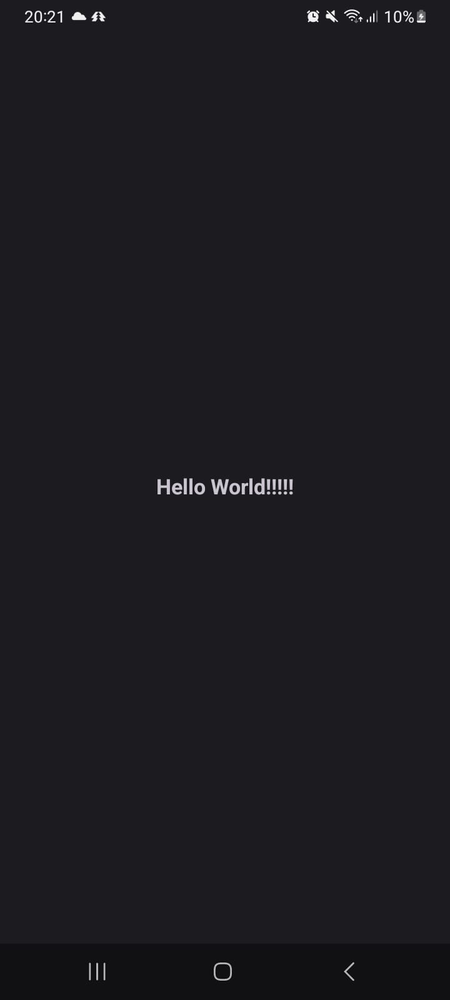
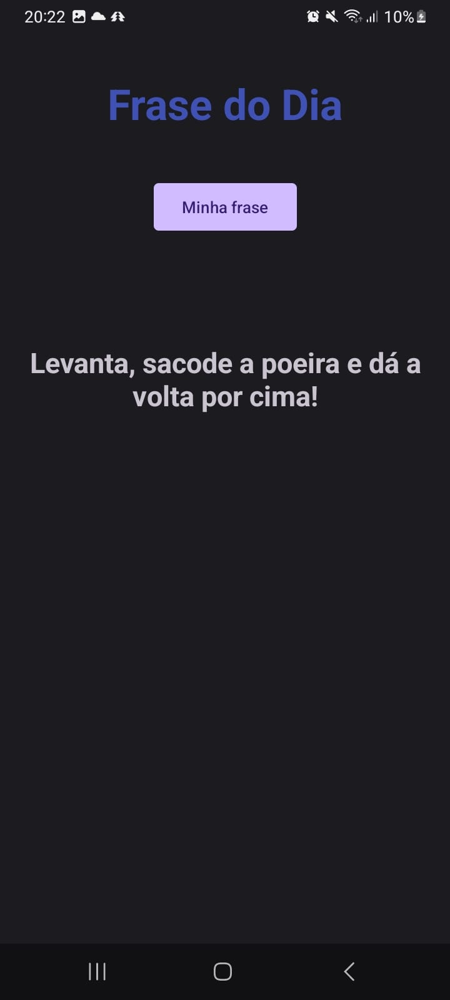
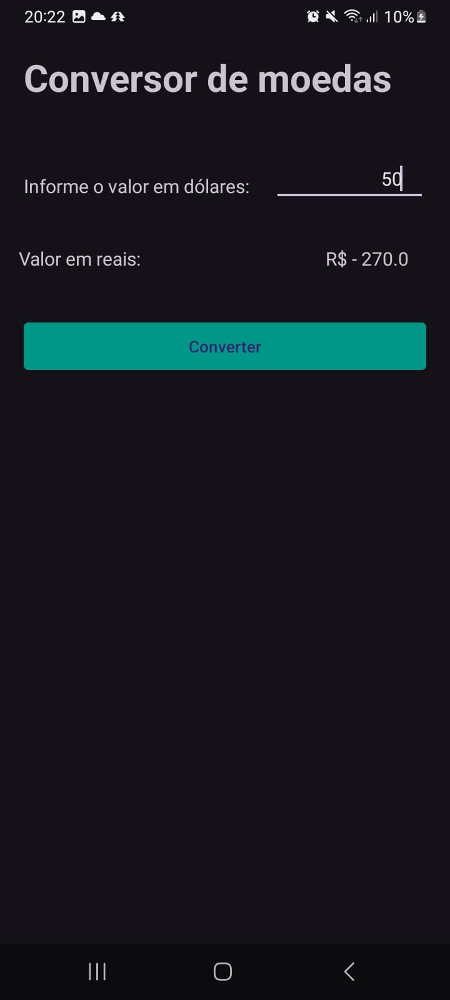
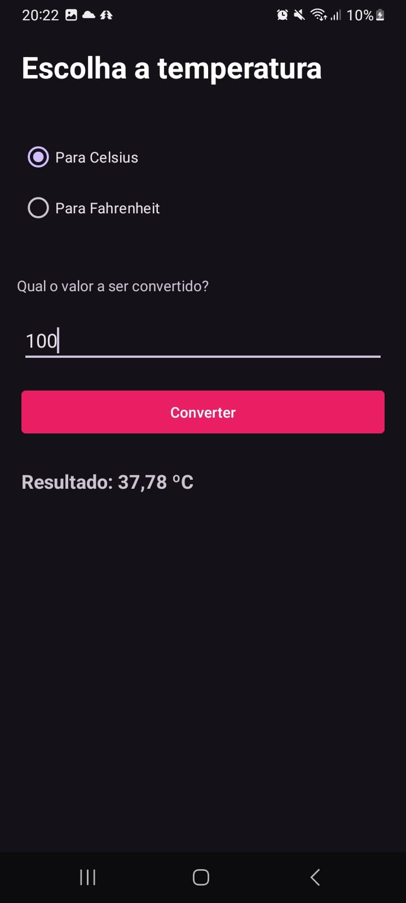
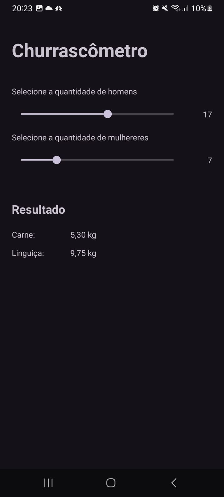
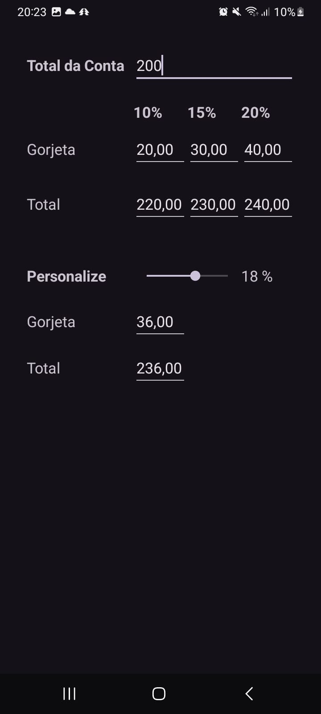
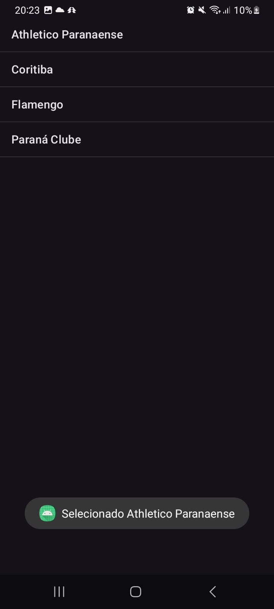
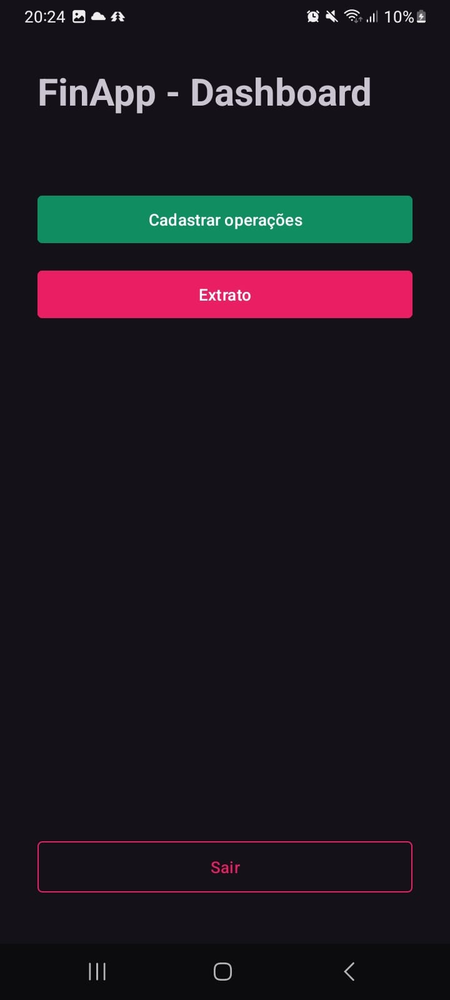
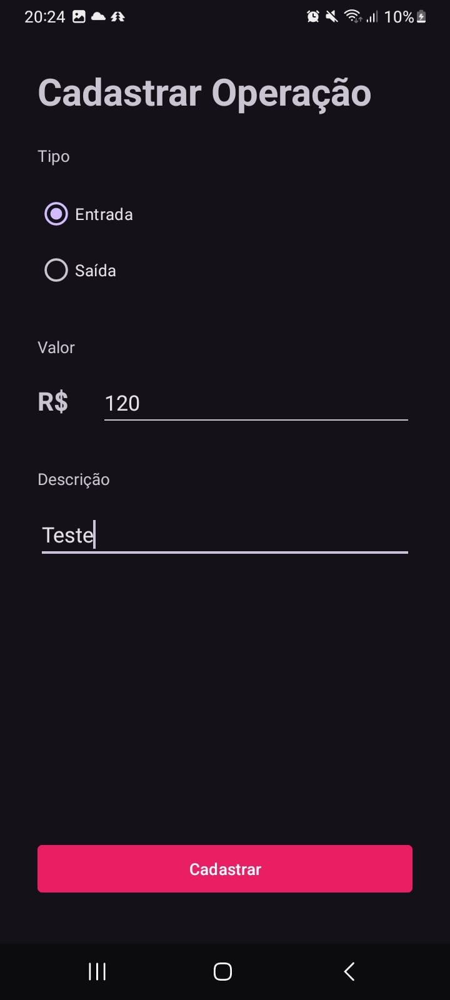
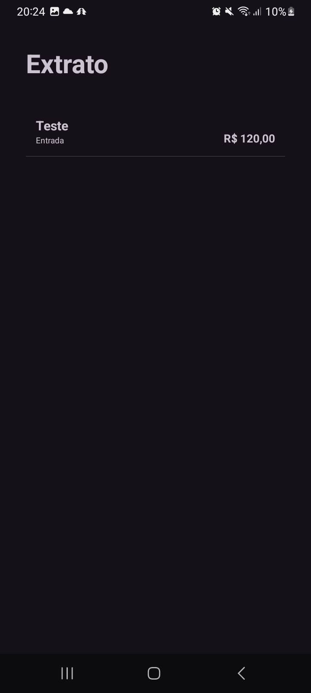

# Android Apps

This is a collection of native apps developed for android in Java/Kotlin as exercises for my graduate program in Agile Software Development.

All the presented exercises are simple but where important to get to know a little about Kotlin and native web development.

> This project showcases frontend engineering skills and is intended for portfolio demonstration only.

## Overview

This collection showcases my progress in native Android development through my mobile development classes, from a simple "Hello World" screen up to a finance app with dynamically generated lists, transaction registration and local data storage.

The apps are numbered according to their progression in the course. Below it's possible to see screenshots of each one along with a brief description.

#### 01. Hello World

This app is a simple demo made to showcase the basics of Kotlin, just a Hello World page.

	

### 02. Frase do Dia (Proverb of the day)

An app that sorts a random phrase in a list and displays them to the user.

	

### 03. Cambio App

Converts values from brazilian real to US dollars (fixed rate).

	

### 04. Number Guess

The user has to guess a number ranging from 1 through 100, on each guess the app shows if the guess is right or wether the correct number is bigger/smaller than the last guess.

At the end the app shows how many guesses it took the user to guess the right number and allows to restart.

	

#### 05. TempCalc

Converts values from Celsius to Fahrenheint and vice-versa.

	

#### 06. Churrascometro

Displays how many kgs of meat and sausage are needed for a barbecue given the number of men and women present. Real time update.

	

#### 07. TipCalc

Given a bill total displays the tip for 10%, 15%, 20% and an arbitrary value from 0% to 25%. Real time update.

	

#### 08.1 MultiActivity

Just a simple showcase of multi activity apps. It has 2 screens in which the user can navigate.

	

#### 08.1 Calculadora IMC

Calculate the user's IMC given its height and weight. MultiActivity.

	

#### 09. StandardList

Exercise with lists in Kotlin. It consists of a simple list, when an item is clicked displays a toast for the user.

	

#### 10. Financas

The user can register transactions (inflows and outflows), transactions are stores in-memory, saved transactions are displayed all on a list.

	
	
	

